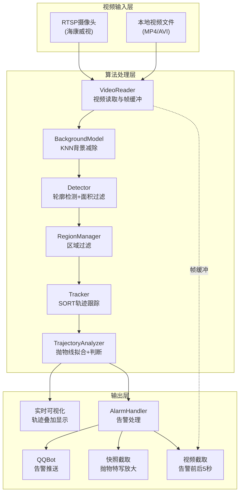
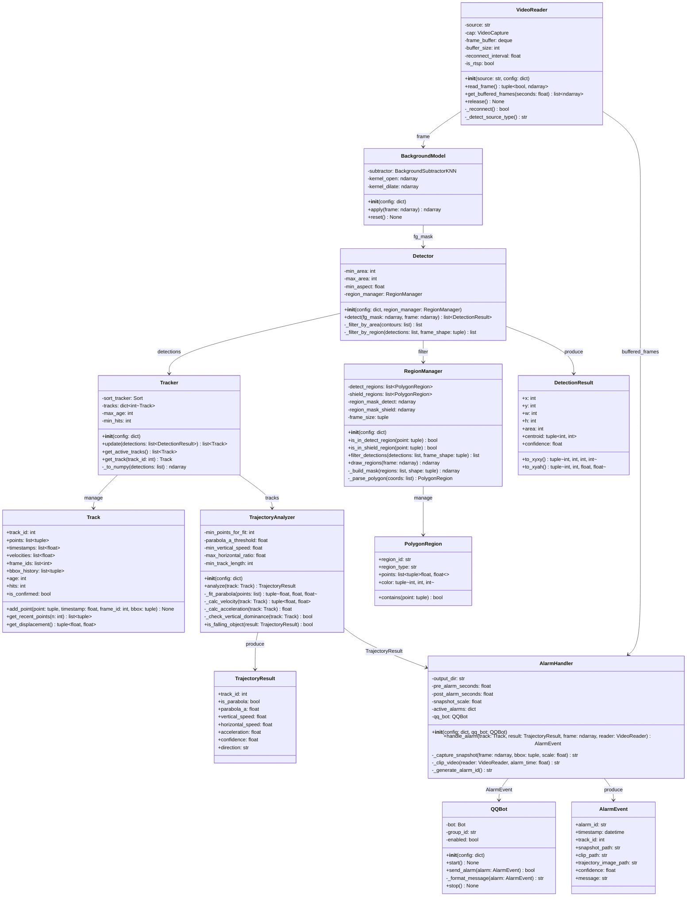
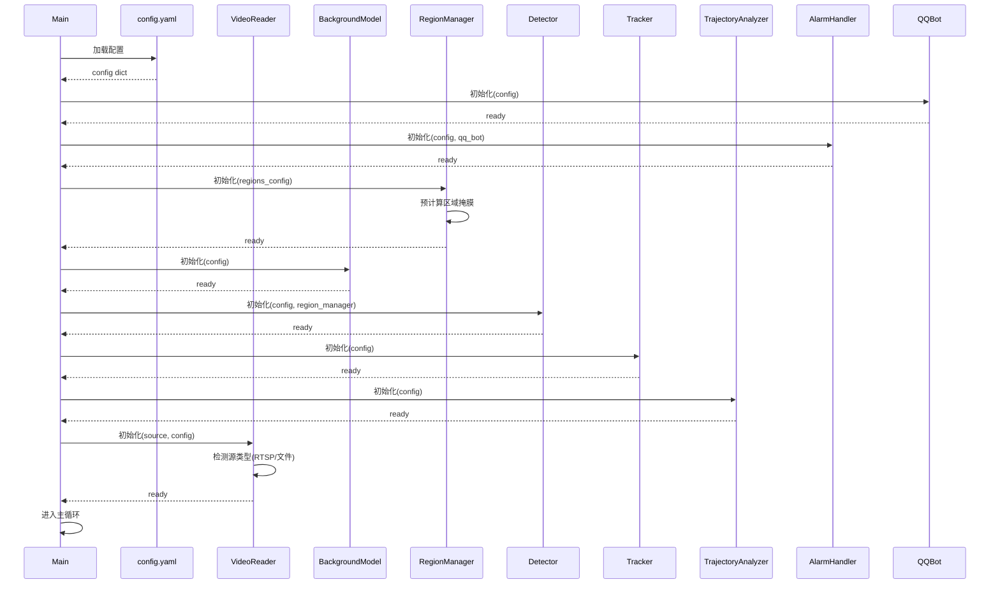
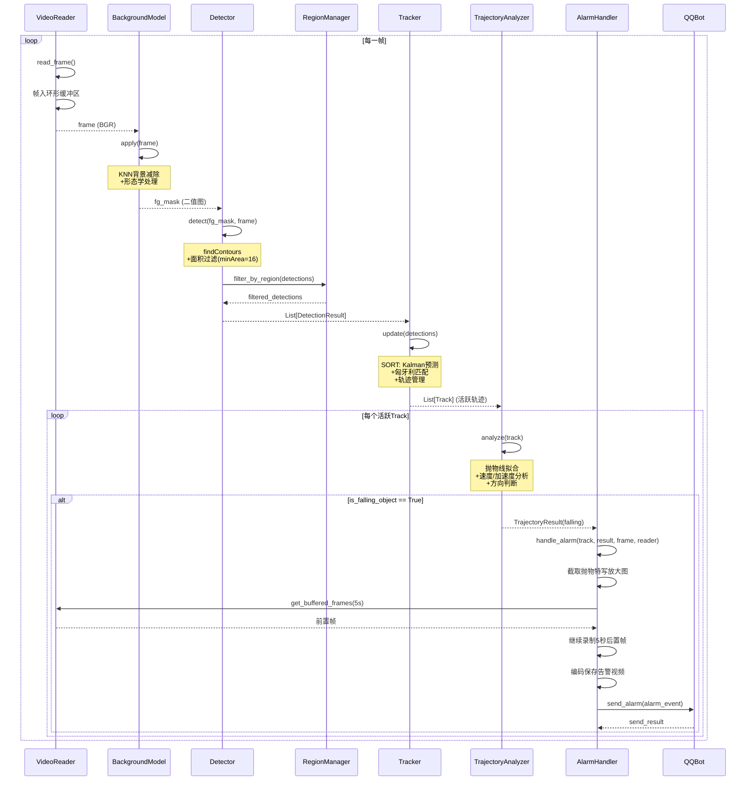
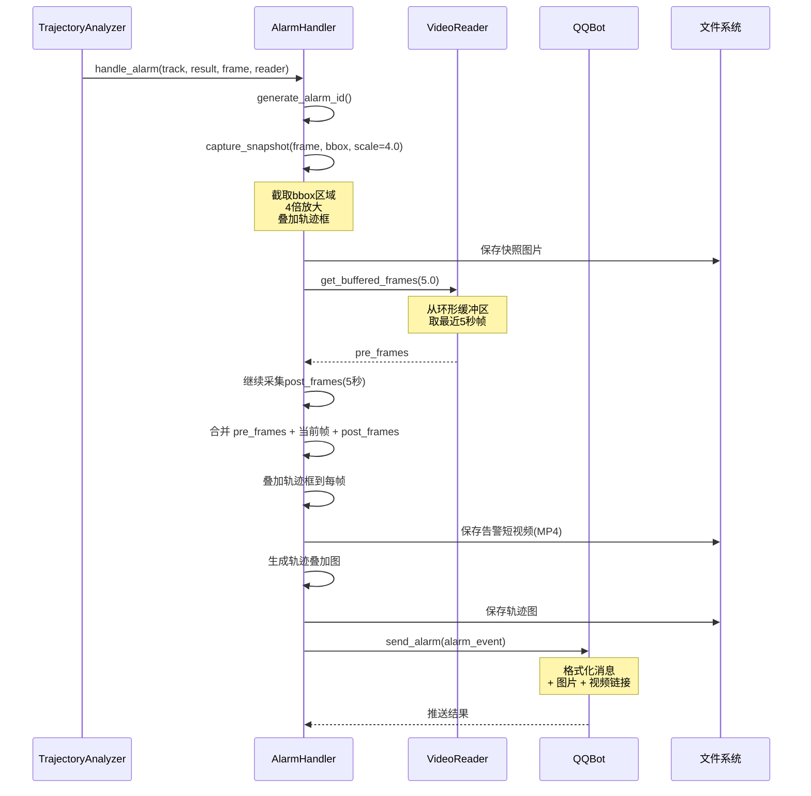
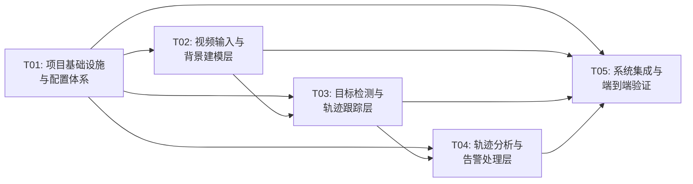

# 高空抛物检测系统 - 系统架构设计文档

> **项目名称**: High Fall Detection System  
> **架构师**: 高见远  
> **版本**: v1.0  
> **日期**: 2025-07-10  
> **技术路线**: 纯视觉算法（Python + OpenCV，无深度学习）

---

## 目录

- [Part A: 系统设计](#part-a-系统设计)
  - [1. 实现方案](#1-实现方案)
  - [2. 文件列表](#2-文件列表)
  - [3. 数据结构与接口](#3-数据结构与接口)
  - [4. 核心程序调用流程](#4-核心程序调用流程)
  - [5. 核心算法详细流程](#5-核心算法详细流程)
  - [6. 关键问题与技术难点](#6-关键问题与技术难点)
  - [7. 待明确事项](#7-待明确事项)
- [Part B: 任务分解](#part-b-任务分解)
  - [8. 依赖包列表](#8-依赖包列表)
  - [9. 任务列表](#9-任务列表)
  - [10. 共享知识](#10-共享知识)
  - [11. 任务依赖图](#11-任务依赖图)

---

# Part A: 系统设计

## 1. 实现方案

### 1.1 核心技术挑战

| 挑战 | 难度 | 应对策略 |
|------|------|----------|
| 极小目标检测（4×4像素） | ★★★★ | KNN高灵敏度参数 + 极小面积阈值 + 形态学优化 |
| 误报过滤（飞鸟/飞虫/树叶） | ★★★★★ | 三点抛物线拟合 + 速度/加速度分析 + 方向判断 |
| RTSP流稳定性 | ★★★ | 断线重连 + 帧跳过策略 + 解码异常处理 |
| 告警前后视频回溯 | ★★★ | 环形帧缓冲区（deque）+ 事件触发式录存 |
| 跨平台兼容性 | ★★ | pathlib路径 + 条件编译 + 抽象文件操作 |
| 多区域多边形判断 | ★★ | cv2.pointPolygonTest + 预计算区域掩膜 |

### 1.2 框架与库选型

| 类别 | 选型 | 理由 |
|------|------|------|
| 视频IO | OpenCV (cv2) | 原生支持RTSP/文件读取，跨平台，性能优 |
| 背景建模 | cv2.createBackgroundSubtractorKNN | OpenCV内置，参数可调，适合静态摄像头 |
| 目标检测 | cv2.findContours | 轻量级，适合前景二值图轮廓提取 |
| 轨迹跟踪 | SORT算法 (sort.py) | 经典卡尔曼+匈牙利算法，单文件实现，GPL-3.0 |
| 抛物判断 | numpy polyfit | 三点二次拟合，物理模型驱动 |
| 配置管理 | PyYAML | 可读性好，支持复杂嵌套结构 |
| QQ机器人 | nonebot2 + nonebot-adapter-onebot | 社区成熟，跨平台，异步支持 |
| 日志 | Python logging | 标准库，零依赖 |
| 视频编码 | cv2.VideoWriter | 原生支持，跨平台codec选择 |

### 1.3 架构模式

采用**管道-过滤器（Pipeline-Filter）** 架构模式：

```
[VideoReader] → [BackgroundModel] → [Detector] → [Tracker] → [TrajectoryAnalyzer] → [AlarmHandler]
                                                                                         ↓
                                                                                   [QQBot / Evidence]
```

每帧数据如同流水线般穿过各处理模块，模块间通过标准数据结构（DetectionResult / Track / Trajectory）传递。各模块独立可测，可单独调参。

### 1.4 系统架构总览



---

## 2. 文件列表

```
high_fall_detection/
├── main.py                          # 主程序入口，管道编排
├── config/
│   ├── config.yaml                  # 主配置文件
│   └── regions_example.yaml         # 区域配置示例
├── src/
│   ├── __init__.py                  # 包初始化
│   ├── video_reader.py             # 视频读取模块（RTSP/文件）
│   ├── background_model.py         # KNN背景建模+形态学处理
│   ├── detector.py                 # 目标检测模块（轮廓+面积+区域过滤）
│   ├── tracker.py                  # SORT轨迹跟踪封装
│   ├── trajectory_analyzer.py      # 轨迹分析+抛物判断
│   ├── region_manager.py           # 检测/屏蔽区域管理
│   ├── alarm_handler.py            # 告警处理+证据留存
│   ├── qq_bot.py                   # QQ机器人告警推送
│   └── utils.py                    # 工具函数（日志、时间、图像处理）
├── sort/
│   ├── __init__.py
│   └── sort.py                     # SORT算法实现（开源，GPL-3.0）
├── output/                          # 输出目录（运行时生成）
│   ├── snapshots/                   # 告警快照图片
│   ├── clips/                       # 告警短视频
│   └── logs/                        # 日志文件
├── tests/
│   ├── __init__.py
│   ├── test_background_model.py    # 背景建模测试
│   ├── test_detector.py            # 目标检测测试
│   ├── test_tracker.py             # 轨迹跟踪测试
│   ├── test_trajectory_analyzer.py # 轨迹分析测试
│   ├── test_region_manager.py      # 区域管理测试
│   └── test_alarm_handler.py       # 告警处理测试
├── requirements.txt                 # 依赖包列表
└── README.md                        # 项目说明
```

### 文件职责说明

| 文件 | 职责 |
|------|------|
| `main.py` | 系统入口，初始化各模块，编排处理管道，管理生命周期 |
| `config/config.yaml` | 所有可配置参数的集中定义 |
| `config/regions_example.yaml` | 多边形区域配置的示例文件 |
| `src/video_reader.py` | RTSP/文件视频读取，断线重连，帧率控制，环形帧缓冲 |
| `src/background_model.py` | KNN背景减除器封装，形态学后处理（开运算+膨胀） |
| `src/detector.py` | 前景轮廓检测，面积/宽高比过滤，检测结果封装 |
| `src/tracker.py` | SORT算法集成层，track生命周期管理，轨迹点缓存 |
| `src/trajectory_analyzer.py` | 三点抛物线拟合，X/Y位移分析，速度/加速度计算，抛物判定 |
| `src/region_manager.py` | 多边形区域定义，点内检测，区域掩膜预计算与缓存 |
| `src/alarm_handler.py` | 告警事件管理，快照截取+放大，视频前后5秒截取 |
| `src/qq_bot.py` | QQ机器人SDK封装，消息格式化，异步推送 |
| `src/utils.py` | 日志配置，时间戳生成，图像处理辅助，文件路径工具 |
| `sort/sort.py` | SORT算法核心实现（KalmanFilter + HungarianAlgorithm） |

---

## 3. 数据结构与接口



### 核心数据类详细定义

#### DetectionResult（检测结果）

```python
@dataclass
class DetectionResult:
    x: int            # 左上角X
    y: int            # 左上角Y
    w: int            # 宽度
    h: int            # 高度
    area: int         # 面积（像素数）
    centroid: Tuple[int, int]  # 质心坐标

    def to_xyxy(self) -> Tuple[int, int, int, int]:
        """转换为 [x1, y1, x2, y2] 格式（SORT输入）"""
        return (self.x, self.y, self.x + self.w, self.y + self.h)
```

#### Track（轨迹数据）

```python
@dataclass
class Track:
    track_id: int                        # 轨迹ID
    points: List[Tuple[int, int]]        # 质心历史点列
    timestamps: List[float]              # 对应时间戳
    frame_ids: List[int]                 # 对应帧号
    bbox_history: List[Tuple[int,int,int,int]]  # bbox历史
    velocities: List[float]              # 速度历史
    age: int = 0                         # 自上次匹配的帧数
    hits: int = 0                        # 总匹配次数
    is_confirmed: bool = False           # 是否已确认

    def add_point(self, point, timestamp, frame_id, bbox):
        """添加轨迹点"""
        ...

    def get_recent_points(self, n: int) -> List[Tuple[int, int]]:
        """获取最近n个轨迹点"""
        ...

    def get_displacement(self) -> Tuple[float, float]:
        """获取X/Y轴总位移"""
        ...
```

#### TrajectoryResult（轨迹分析结果）

```python
@dataclass
class TrajectoryResult:
    track_id: int           # 关联轨迹ID
    is_parabola: bool       # 是否为抛物线
    parabola_a: float       # 二次项系数（a > 0 → 下落）
    parabola_b: float       # 一次项系数
    parabola_c: float       # 常数项
    vertical_speed: float   # 垂直速度（像素/秒，向下为正）
    horizontal_speed: float # 水平速度（像素/秒）
    acceleration: float     # 加速度
    confidence: float       # 置信度 [0, 1]
    direction: str          # 运动方向: "down" / "up" / "diagonal"
```

#### AlarmEvent（告警事件）

```python
@dataclass
class AlarmEvent:
    alarm_id: str                # 告警唯一ID（时间戳+随机数）
    timestamp: datetime          # 告警时间
    track_id: int                # 关联轨迹ID
    snapshot_path: str           # 快照图片路径
    clip_path: str               # 告警视频路径
    trajectory_image_path: str   # 轨迹叠加图路径
    confidence: float            # 置信度
    message: str                 # 格式化告警消息
```

#### PolygonRegion（多边形区域）

```python
@dataclass
class PolygonRegion:
    region_id: str                       # 区域ID
    region_type: str                     # "detect" 或 "shield"
    points: List[Tuple[float, float]]   # 多边形顶点（归一化坐标0~1）
    color: Tuple[int, int, int]          # 显示颜色

    def contains(self, point: Tuple[int, int], frame_shape: Tuple) -> bool:
        """判断点是否在多边形内"""
        ...
```

---

## 4. 核心程序调用流程

### 4.1 系统初始化流程



### 4.2 逐帧处理流程



### 4.3 告警处理流程



---

## 5. 核心算法详细流程

### 5.1 视频读取模块 (`video_reader.py`)

```python
class VideoReader:
    """
    支持RTSP流和本地文件的统一视频读取器。
    内置环形帧缓冲区用于告警视频回溯。
    """

    def __init__(self, source: str, config: dict):
        self.source = source
        self.is_rtsp = source.startswith("rtsp://")
        self.reconnect_interval = config.get("reconnect_interval", 3.0)
        self.buffer_seconds = config.get("buffer_seconds", 6)  # 多缓冲1秒余量

        # 环形帧缓冲区: {frame_id: (timestamp, frame)}
        self.frame_buffer = deque(maxlen=self.buffer_seconds * 30)  # 假设30fps
        self.current_fps = 0

        self._open()

    def _open(self) -> bool:
        """打开视频源"""
        self.cap = cv2.VideoCapture(self.source)
        if self.is_rtsp:
            # RTSP专用设置: 降低延迟
            self.cap.set(cv2.CAP_PROP_BUFFERSIZE, 1)  # 最小缓冲
        if not self.cap.isOpened():
            raise ConnectionError(f"无法打开视频源: {self.source}")
        self.current_fps = self.cap.get(cv2.CAP_PROP_FPS) or 25.0
        return True

    def read_frame(self) -> Tuple[bool, np.ndarray]:
        """读取一帧，失败时自动重连"""
        ret, frame = self.cap.read()
        if not ret:
            if self.is_rtsp:
                logger.warning("RTSP读取失败，尝试重连...")
                return self._reconnect_and_read()
            else:
                # 文件结束：循环播放或结束
                return False, None
        return True, frame

    def get_buffered_frames(self, seconds: float) -> List[Tuple[float, np.ndarray]]:
        """获取最近N秒的缓冲帧（用于告警视频回溯）"""
        count = int(seconds * self.current_fps)
        buffered = list(self.frame_buffer)
        return buffered[-count:]

    def _reconnect_and_read(self) -> Tuple[bool, np.ndarray]:
        """RTSP断线重连逻辑"""
        for attempt in range(10):  # 最多重试10次
            time.sleep(self.reconnect_interval)
            try:
                self.cap.release()
                self._open()
                ret, frame = self.cap.read()
                if ret:
                    logger.info(f"RTSP重连成功(第{attempt+1}次)")
                    return True, frame
            except Exception as e:
                logger.error(f"重连失败: {e}")
        return False, None
```

### 5.2 背景建模模块 (`background_model.py`)

```python
class BackgroundModel:
    """
    KNN背景减除器封装。
    history=7, dist2Threshold=800-1000, detectShadows=False
    后接形态学处理：开运算(去噪) + 轻度膨胀(填充空洞)
    """

    def __init__(self, config: dict):
        knn_config = config["background_model"]

        # 创建KNN背景减除器
        self.subtractor = cv2.createBackgroundSubtractorKNN(
            history=knn_config.get("history", 7),
            dist2Threshold=knn_config.get("dist2_threshold", 800),
            detectShadows=knn_config.get("detect_shadows", False)
        )

        # 形态学核
        open_size = knn_config.get("morph_open_size", 3)
        dilate_size = knnn_config.get("morph_dilate_size", 2)
        self.kernel_open = cv2.getStructuringElement(
            cv2.MORPH_ELLIPSE, (open_size, open_size)
        )
        self.kernel_dilate = cv2.getStructuringElement(
            cv2.MORPH_ELLIPSE, (dilate_size, dilate_size)
        )

        # 形态学迭代次数
        self.open_iterations = knn_config.get("open_iterations", 1)
        self.dilate_iterations = knn_config.get("dilate_iterations", 1)

    def apply(self, frame: np.ndarray) -> np.ndarray:
        """
        对输入帧进行背景减除+形态学处理，返回二值前景掩膜。
        """
        # Step 1: KNN背景减除
        fg_mask = self.subtractor.apply(frame)

        # Step 2: 二值化（消除阴影残留，虽然detectShadows=False）
        _, fg_mask = cv2.threshold(fg_mask, 200, 255, cv2.THRESH_BINARY)

        # Step 3: 开运算 - 去除小噪点（飞虫、像素噪声）
        fg_mask = cv2.morphologyEx(
            fg_mask, cv2.MORPH_OPEN,
            self.kernel_open,
            iterations=self.open_iterations
        )

        # Step 4: 轻度膨胀 - 填充目标内部空洞，连接断裂轮廓
        fg_mask = cv2.dilate(
            fg_mask, self.kernel_dilate,
            iterations=self.dilate_iterations
        )

        return fg_mask
```

### 5.3 目标检测模块 (`detector.py`)

```python
class Detector:
    """
    基于前景掩膜的目标检测器。
    流程: 轮廓检测 → 面积过滤 → 区域过滤
    """

    def __init__(self, config: dict, region_manager: RegionManager):
        det_config = config["detector"]
        self.min_area = det_config.get("min_area", 16)      # 4×4=16像素
        self.max_area = det_config.get("max_area", 5000)    # 过滤大面积
        self.min_aspect = det_config.get("min_aspect", 0.1)  # 最小宽高比
        self.max_aspect = det_config.get("max_aspect", 10.0) # 最大宽高比
        self.min_solidity = det_config.get("min_solidity", 0.3)  # 最小密实度
        self.region_manager = region_manager

    def detect(self, fg_mask: np.ndarray, frame: np.ndarray) -> List[DetectionResult]:
        """检测前景掩膜中的目标"""
        # Step 1: 轮廓检测
        contours, _ = cv2.findContours(
            fg_mask, cv2.RETR_EXTERNAL, cv2.CHAIN_APPROX_SIMPLE
        )

        # Step 2: 轮廓筛选
        detections = []
        for contour in contours:
            area = cv2.contourArea(contour)

            # 面积过滤
            if area < self.min_area or area > self.max_area:
                continue

            # 外接矩形
            x, y, w, h = cv2.boundingRect(contour)

            # 宽高比过滤
            aspect = w / max(h, 1)
            if aspect < self.min_aspect or aspect > self.max_aspect:
                continue

            # 密实度过滤（轮廓面积/外接矩形面积）
            solidity = area / max(w * h, 1)
            if solidity < self.min_solidity:
                continue

            # 质心
            M = cv2.moments(contour)
            if M["m00"] > 0:
                cx = int(M["m10"] / M["m00"])
                cy = int(M["m01"] / M["m00"])
            else:
                cx, cy = x + w // 2, y + h // 2

            detections.append(DetectionResult(
                x=x, y=y, w=w, h=h,
                area=area,
                centroid=(cx, cy)
            ))

        # Step 3: 区域过滤
        if self.region_manager.has_regions():
            detections = self.region_manager.filter_detections(
                detections, frame.shape
            )

        return detections
```

### 5.4 轨迹跟踪模块 (`tracker.py`)

```python
class Tracker:
    """
    SORT算法集成层。
    封装sort.py，管理Track对象生命周期。
    """

    def __init__(self, config: dict):
        tracker_config = config["tracker"]
        self.max_age = tracker_config.get("max_age", 3)
        self.min_hits = tracker_config.get("min_hits", 5)
        self.iou_threshold = tracker_config.get("iou_threshold", 0.1)

        self.sort = Sort(
            max_age=self.max_age,
            min_hits=self.min_hits,
            iou_threshold=self.iou_threshold
        )

        # 轨迹管理: track_id → Track
        self.tracks: Dict[int, Track] = {}
        self.next_track_check_id = 0

    def update(self, detections: List[DetectionResult]) -> List[Track]:
        """
        使用SORT更新跟踪状态。
        输入: 当前帧检测结果
        输出: 当前活跃的确认轨迹列表
        """
        # 转换为SORT输入格式: [x1, y1, x2, y2, score]
        if len(detections) > 0:
            dets = np.array([d.to_xyxy() + (1.0,) for d in detections])
        else:
            dets = np.empty((0, 5))

        # SORT更新
        trackers = self.sort.update(dets)
        # trackers格式: [[x1, y1, x2, y2, track_id], ...]

        # 更新Track对象
        active_tracks = []
        for t in trackers:
            x1, y1, x2, y2, track_id = [int(v) if i < 4 else v for i, v in enumerate(t)]
            track_id = int(track_id)
            centroid = ((x1 + x2) // 2, (y1 + y2) // 2)
            bbox = (x1, y1, x2 - x1, y2 - y1)
            timestamp = time.time()

            if track_id not in self.tracks:
                self.tracks[track_id] = Track(track_id=track_id)

            self.tracks[track_id].add_point(centroid, timestamp, frame_id, bbox)

            if self.tracks[track_id].hits >= self.min_hits:
                self.tracks[track_id].is_confirmed = True
                active_tracks.append(self.tracks[track_id])

        # 清理过期Track
        self._cleanup_stale_tracks()

        return active_tracks

    def _cleanup_stale_tracks(self):
        """移除超龄的Track对象"""
        stale_ids = [
            tid for tid, track in self.tracks.items()
            if track.age > self.max_age * 2
        ]
        for tid in stale_ids:
            del self.tracks[tid]
```

### 5.5 抛物判断模块 (`trajectory_analyzer.py`)

```python
class TrajectoryAnalyzer:
    """
    轨迹分析器 - 判断轨迹是否为高空抛物。
    核心算法:
    1. 三点抛物线拟合（y = ax² + bx + c）→ 判断 a > 0
    2. X/Y轴位移分离判断 → 垂直位移主导
    3. 速度/加速度阈值过滤 → 下落速度超阈值
    """

    def __init__(self, config: dict):
        ta_config = config["trajectory_analyzer"]
        self.min_points = ta_config.get("min_points_for_fit", 5)
        self.parabola_a_threshold = ta_config.get("parabola_a_threshold", 0.01)
        self.min_vertical_speed = ta_config.get("min_vertical_speed", 2.0)    # 像素/帧
        self.max_horizontal_ratio = ta_config.get("max_horizontal_ratio", 2.0) # 水平/垂直速度比
        self.min_track_length = ta_config.get("min_track_length", 5)
        self.min_acceleration = ta_config.get("min_acceleration", 0.1)
        self.fit_recent_n = ta_config.get("fit_recent_n", 8)  # 用最近N个点拟合

    def analyze(self, track: Track) -> TrajectoryResult:
        """分析轨迹，判断是否为抛物"""

        points = track.get_recent_points(self.fit_recent_n)
        if len(points) < self.min_points:
            return TrajectoryResult(
                track_id=track.track_id, is_parabola=False,
                parabola_a=0, parabola_b=0, parabola_c=0,
                vertical_speed=0, horizontal_speed=0,
                acceleration=0, confidence=0.0, direction="unknown"
            )

        # 提取x, y序列（注意：图像坐标系y向下为正）
        xs = np.array([p[0] for p in points], dtype=np.float64)
        ys = np.array([p[1] for p in points], dtype=np.float64)

        # === 算法1: 三点抛物线拟合 ===
        # y = a*x^2 + b*x + c
        # 对最近N个点做二次拟合
        try:
            coeffs = np.polyfit(xs, ys, 2)  # [a, b, c]
            a, b, c = coeffs
        except (np.linalg.LinAlgError, ValueError):
            a, b, c = 0, 0, 0

        is_parabola = a > self.parabola_a_threshold  # a>0 → 开口向下落

        # === 算法2: X/Y位移分离判断 ===
        total_dx = abs(xs[-1] - xs[0])
        total_dy = ys[-1] - ys[0]  # 正值=向下（图像坐标）

        # 垂直速度（像素/帧间隔）
        n_frames = len(points) - 1
        vertical_speed = total_dy / max(n_frames, 1)
        horizontal_speed = total_dx / max(n_frames, 1)

        # 垂直方向主导？
        is_vertical_dominant = (
            vertical_speed > self.min_vertical_speed and
            (horizontal_speed / max(vertical_speed, 0.001)) < self.max_horizontal_ratio
        )

        # === 算法3: 速度/加速度分析 ===
        if len(track.velocities) >= 3:
            acceleration = track.velocities[-1] - track.velocities[-3]
        else:
            acceleration = 0

        is_accelerating = acceleration > self.min_acceleration

        # === 综合判定 ===
        # 满足条件越多，置信度越高
        conditions_met = sum([is_parabola, is_vertical_dominant, is_accelerating])
        confidence = conditions_met / 3.0

        # 判定为抛物: 至少满足2/3条件
        is_falling = conditions_met >= 2 and vertical_speed > 0

        # 方向判断
        if total_dy > 0 and total_dx < total_dy * 0.5:
            direction = "down"
        elif total_dy > 0:
            direction = "diagonal"
        elif total_dy < 0:
            direction = "up"
        else:
            direction = "horizontal"

        return TrajectoryResult(
            track_id=track.track_id,
            is_parabola=is_parabola,
            parabola_a=a, parabola_b=b, parabola_c=c,
            vertical_speed=vertical_speed,
            horizontal_speed=horizontal_speed,
            acceleration=acceleration,
            confidence=confidence,
            direction=direction
        )

    def is_falling_object(self, result: TrajectoryResult) -> bool:
        """最终判定: 是否为高空抛物"""
        return (
            result.confidence >= 0.6 and
            result.direction in ("down", "diagonal") and
            result.vertical_speed > self.min_vertical_speed
        )
```

### 5.6 区域配置模块 (`region_manager.py`)

```python
class RegionManager:
    """
    检测/屏蔽区域管理器。
    支持不少于10个多边形区域，边数无限制。
    使用预计算掩膜加速判断。
    """

    def __init__(self, config: dict):
        self.detect_regions: List[PolygonRegion] = []
        self.shield_regions: List[PolygonRegion] = []
        self._region_mask_detect: Optional[np.ndarray] = None
        self._region_mask_shield: Optional[np.ndarray] = None
        self._frame_size: Optional[Tuple[int, int]] = None

        # 解析区域配置
        for region_cfg in config.get("detect_regions", []):
            self.detect_regions.append(self._parse_polygon(region_cfg, "detect"))

        for region_cfg in config.get("shield_regions", []):
            self.shield_regions.append(self._parse_polygon(region_cfg, "shield"))

    def _parse_polygon(self, cfg: dict, region_type: str) -> PolygonRegion:
        """解析多边形配置（归一化坐标0~1 → 像素坐标在build时转换）"""
        return PolygonRegion(
            region_id=cfg["id"],
            region_type=region_type,
            points=[(p["x"], p["y"]) for p in cfg["points"]],
            color=tuple(cfg.get("color", [0, 255, 0]))
        )

    def _build_masks(self, shape: Tuple[int, int, int]):
        """预计算区域掩膜（加速后续判断）"""
        h, w = shape[:2]
        self._frame_size = (h, w)

        # 检测区域掩膜: 白色=检测区域
        if self.detect_regions:
            self._region_mask_detect = np.zeros((h, w), dtype=np.uint8)
            for region in self.detect_regions:
                pts = np.array(
                    [[int(p[0]*w), int(p[1]*h)] for p in region.points],
                    dtype=np.int32
                )
                cv2.fillPoly(self._region_mask_detect, [pts], 255)

        # 屏蔽区域掩膜: 白色=屏蔽区域
        if self.shield_regions:
            self._region_mask_shield = np.zeros((h, w), dtype=np.uint8)
            for region in self.shield_regions:
                pts = np.array(
                    [[int(p[0]*w), int(p[1]*h)] for p in region.points],
                    dtype=np.int32
                )
                cv2.fillPoly(self._region_mask_shield, [pts], 255)

    def is_in_detect_region(self, point: Tuple[int, int]) -> bool:
        """判断点是否在检测区域内"""
        if self._region_mask_detect is None:
            return True  # 无检测区域限制 → 全画面检测
        return self._region_mask_detect[point[1], point[0]] > 0

    def is_in_shield_region(self, point: Tuple[int, int]) -> bool:
        """判断点是否在屏蔽区域内"""
        if self._region_mask_shield is None:
            return False
        return self._region_mask_shield[point[1], point[0]] > 0

    def filter_detections(self, detections: List[DetectionResult],
                          frame_shape: Tuple) -> List[DetectionResult]:
        """过滤检测结果: 保留检测区域内且不在屏蔽区域内的目标"""
        if self._frame_size != frame_shape[:2]:
            self._build_masks(frame_shape)

        filtered = []
        for det in detections:
            # 质心在检测区域内？
            in_detect = self.is_in_detect_region(det.centroid)
            # 质心不在屏蔽区域内？
            not_in_shield = not self.is_in_shield_region(det.centroid)

            if in_detect and not_in_shield:
                filtered.append(det)

        return filtered

    def draw_regions(self, frame: np.ndarray) -> np.ndarray:
        """在帧上绘制区域边界（可视化用）"""
        overlay = frame.copy()
        for region in self.detect_regions:
            pts = np.array(
                [[int(p[0]*frame.shape[1]), int(p[1]*frame.shape[0])]
                 for p in region.points],
                dtype=np.int32
            )
            cv2.fillPoly(overlay, [pts], (*region.color, 30))
            cv2.polylines(frame, [pts], True, region.color, 2)

        for region in self.shield_regions:
            pts = np.array(
                [[int(p[0]*frame.shape[1]), int(p[1]*frame.shape[0])]
                 for p in region.points],
                dtype=np.int32
            )
            cv2.fillPoly(overlay, [pts], (0, 0, 255, 30))
            cv2.polylines(frame, [pts], True, (0, 0, 255), 2)

        cv2.addWeighted(overlay, 0.3, frame, 0.7, 0, frame)
        return frame
```

### 5.7 告警处理模块 (`alarm_handler.py`)

```python
class AlarmHandler:
    """
    告警处理器。
    职责: 截取快照(4倍放大) + 录制前后5秒视频 + 推送告警
    """

    def __init__(self, config: dict, qq_bot: QQBot):
        alarm_config = config["alarm"]
        self.output_dir = Path(alarm_config.get("output_dir", "output"))
        self.pre_alarm_seconds = alarm_config.get("pre_alarm_seconds", 5.0)
        self.post_alarm_seconds = alarm_config.get("post_alarm_seconds", 5.0)
        self.snapshot_scale = alarm_config.get("snapshot_scale", 4.0)
        self.qq_bot = qq_bot

        # 创建输出目录
        (self.output_dir / "snapshots").mkdir(parents=True, exist_ok=True)
        (self.output_dir / "clips").mkdir(parents=True, exist_ok=True)

        # 防重复告警: 同一track_id的冷却时间
        self.alarm_cooldown = alarm_config.get("cooldown_seconds", 10.0)
        self._last_alarm_time: Dict[int, float] = {}

    def handle_alarm(self, track: Track, result: TrajectoryResult,
                     frame: np.ndarray, reader: VideoReader) -> Optional[AlarmEvent]:
        """处理告警事件"""

        # 冷却检查
        now = time.time()
        if track.track_id in self._last_alarm_time:
            if now - self._last_alarm_time[track.track_id] < self.alarm_cooldown:
                return None

        self._last_alarm_time[track.track_id] = now

        # Step 1: 生成告警ID
        alarm_id = self._generate_alarm_id()

        # Step 2: 截取抛物特写快照（4倍放大）
        # 找到最新bbox
        latest_bbox = track.bbox_history[-1] if track.bbox_history else (0,0,0,0)
        snapshot_path = self._capture_snapshot(frame, latest_bbox, track, alarm_id)

        # Step 3: 截取告警视频（前后5秒）
        clip_path = self._clip_video(reader, track, alarm_id)

        # Step 4: 生成轨迹叠加图
        traj_img_path = self._save_trajectory_image(frame, track, alarm_id)

        # Step 5: 构建告警事件
        alarm = AlarmEvent(
            alarm_id=alarm_id,
            timestamp=datetime.now(),
            track_id=track.track_id,
            snapshot_path=str(snapshot_path),
            clip_path=str(clip_path),
            trajectory_image_path=str(traj_img_path),
            confidence=result.confidence,
            message=self._format_alarm_message(alarm_id, result, track)
        )

        # Step 6: QQ推送
        self.qq_bot.send_alarm(alarm)

        logger.info(f"告警已处理: {alarm_id}, track={track.track_id}")
        return alarm

    def _capture_snapshot(self, frame: np.ndarray, bbox: Tuple,
                         track: Track, alarm_id: str) -> Path:
        """截取抛物特写放大图"""
        x, y, w, h = bbox
        # 扩展ROI（留一些上下文）
        pad = max(w, h) // 2
        x1 = max(0, x - pad)
        y1 = max(0, y - pad)
        x2 = min(frame.shape[1], x + w + pad)
        y2 = min(frame.shape[0], y + h + pad)

        roi = frame[y1:y2, x1:x2]

        # 4倍放大
        h_roi, w_roi = roi.shape[:2]
        roi_scaled = cv2.resize(
            roi, (int(w_roi * self.snapshot_scale), int(h_roi * self.snapshot_scale)),
            interpolation=cv2.INTER_CUBIC
        )

        # 在放大图上叠加轨迹点
        for pt in track.points[-10:]:
            scaled_pt = (
                int((pt[0] - x1) * self.snapshot_scale),
                int((pt[1] - y1) * self.snapshot_scale)
            )
            cv2.circle(roi_scaled, scaled_pt, 3, (0, 0, 255), -1)

        path = self.output_dir / "snapshots" / f"{alarm_id}.jpg"
        cv2.imwrite(str(path), roi_scaled)
        return path

    def _clip_video(self, reader: VideoReader, track: Track,
                    alarm_id: str) -> Path:
        """截取告警前后5秒视频"""
        # 获取前置帧
        pre_frames = reader.get_buffered_frames(self.pre_alarm_seconds)

        # 获取后置帧（需在主循环中继续采集后调用）
        # 此处简化: 实际由主循环在告警后继续采集post_alarm_seconds帧
        all_frames = pre_frames  # + post_frames (在主循环中补充)

        # 叠加轨迹框
        for i, (ts, f) in enumerate(all_frames):
            self._draw_track_overlay(f, track)

        # 编码保存
        path = self.output_dir / "clips" / f"{alarm_id}.mp4"
        h, w = all_frames[0][1].shape[:2]
        fourcc = cv2.VideoWriter_fourcc(*'mp4v')
        writer = cv2.VideoWriter(str(path), fourcc, reader.current_fps, (w, h))
        for ts, f in all_frames:
            writer.write(f)
        writer.release()
        return path
```

### 5.8 QQ机器人推送模块 (`qq_bot.py`)

```python
class QQBot:
    """
    QQ机器人告警推送。
    使用nonebot2 + onebot适配器，支持跨平台。
    """

    def __init__(self, config: dict):
        qq_config = config.get("qq_bot", {})
        self.enabled = qq_config.get("enabled", False)
        self.group_id = qq_config.get("group_id", "")
        self.api_url = qq_config.get("api_url", "")
        self.bot = None

        if self.enabled:
            self._init_bot(qq_config)

    def _init_bot(self, config: dict):
        """初始化QQ机器人连接"""
        # 使用HTTP API方式（轻量级，不依赖nonebot2完整框架）
        self.api_url = config.get("api_url", "http://localhost:8080")
        self.access_token = config.get("access_token", "")
        logger.info("QQ机器人已初始化")

    def send_alarm(self, alarm: AlarmEvent) -> bool:
        """发送告警消息到QQ群"""
        if not self.enabled:
            logger.debug("QQ推送未启用，跳过")
            return False

        try:
            message = self._format_message(alarm)

            # 发送文字消息
            self._send_group_message(self.group_id, message)

            # 发送快照图片
            if alarm.snapshot_path and Path(alarm.snapshot_path).exists():
                self._send_group_image(self.group_id, alarm.snapshot_path)

            logger.info(f"告警已推送: {alarm.alarm_id}")
            return True

        except Exception as e:
            logger.error(f"QQ推送失败: {e}")
            return False

    def _format_message(self, alarm: AlarmEvent) -> str:
        """格式化告警消息"""
        return (
            f"🚨 高空抛物告警 🚨\n"
            f"告警ID: {alarm.alarm_id}\n"
            f"时间: {alarm.timestamp.strftime('%Y-%m-%d %H:%M:%S')}\n"
            f"置信度: {alarm.confidence:.1%}\n"
            f"轨迹ID: {alarm.track_id}\n"
            f"请及时处理！"
        )

    def _send_group_message(self, group_id: str, message: str) -> dict:
        """通过OneBot HTTP API发送群消息"""
        url = f"{self.api_url}/send_group_msg"
        payload = {
            "group_id": int(group_id),
            "message": message
        }
        headers = {"Authorization": f"Bearer {self.access_token}"} if self.access_token else {}
        resp = requests.post(url, json=payload, headers=headers, timeout=5)
        return resp.json()

    def _send_group_image(self, group_id: str, image_path: str) -> dict:
        """发送群图片"""
        url = f"{self.api_url}/send_group_msg"
        # OneBot CQ码格式发送图片
        payload = {
            "group_id": int(group_id),
            "message": f"[CQ:image,file=file://{image_path}]"
        }
        headers = {"Authorization": f"Bearer {self.access_token}"} if self.access_token else {}
        resp = requests.post(url, json=payload, headers=headers, timeout=10)
        return resp.json()
```

### 5.9 主程序入口 (`main.py`)

```python
def main():
    # Step 1: 加载配置
    config = load_config("config/config.yaml")

    # Step 2: 初始化各模块
    qq_bot = QQBot(config)
    alarm_handler = AlarmHandler(config, qq_bot)
    region_manager = RegionManager(config.get("regions", {}))
    bg_model = BackgroundModel(config)
    detector = Detector(config, region_manager)
    tracker = Tracker(config)
    trajectory_analyzer = TrajectoryAnalyzer(config)

    # Step 3: 初始化视频源（支持多路）
    sources = config["video_sources"]
    readers = [VideoReader(src["url"], config) for src in sources]

    # Step 4: 主处理循环
    running = True
    while running:
        for i, reader in enumerate(readers):
            ret, frame = reader.read_frame()
            if not ret:
                continue

            # 管道处理
            fg_mask = bg_model.apply(frame)
            detections = detector.detect(fg_mask, frame)
            tracks = tracker.update(detections)

            for track in tracks:
                if not track.is_confirmed:
                    continue
                result = trajectory_analyzer.analyze(track)

                if trajectory_analyzer.is_falling_object(result):
                    alarm_handler.handle_alarm(track, result, frame, reader)

            # 可视化（可选）
            if config.get("display", False):
                vis_frame = draw_detections(frame, tracks)
                vis_frame = region_manager.draw_regions(vis_frame)
                cv2.imshow(f"Camera {i}", vis_frame)
                if cv2.waitKey(1) & 0xFF == ord('q'):
                    running = False

    # Step 5: 清理
    for reader in readers:
        reader.release()
    cv2.destroyAllWindows()
```

---

## 6. 关键问题与技术难点

### 6.1 极小目标检测（4×4像素）

**难点**: 极小目标在背景减除后仅占极少像素，容易被形态学操作消除。

**解决方案**:
- KNN参数调优: `dist2Threshold` 偏低（800），提高灵敏度
- 形态学核控制在3×3以内，避免消除小目标
- 面积阈值设为16（4×4），不遗漏极小目标
- 开运算仅1次迭代，膨胀1次迭代

### 6.2 误报过滤（飞鸟/飞虫/树叶）

**难点**: 飞鸟/飞虫与抛物的运动模式在短时间内可能相似。

**解决方案**:
- **抛物线拟合判别**: 飞鸟轨迹偏直线或曲线向上，不满足 `a > 0`（开口向下）
- **速度/加速度**: 抛物下落有加速度特征，飞鸟匀速或减速
- **方向判断**: 抛物以垂直运动为主，飞鸟以水平运动为主
- **连续帧验证**: `min_hits=5`，要求至少连续5帧匹配才确认轨迹
- **密实度过滤**: 飞虫轮廓松散，密实度低

### 6.3 RTSP流稳定性

**难点**: 网络波动导致RTSP断流，需要自动重连且不丢帧过多。

**解决方案**:
- 设置 `CAP_PROP_BUFFERSIZE=1`，降低延迟
- 检测断流后自动重连，指数退避策略
- 重连期间日志记录，不影响其他路摄像头
- 帧读取失败时跳过该帧，不阻塞管道

### 6.4 告警前后5秒视频回溯

**难点**: 告警发生时，前置5秒视频已过，需要提前缓存。

**解决方案**:
- 使用 `collections.deque` 作为环形帧缓冲区
- 缓存容量: 6秒帧数（5秒+1秒余量）
- 告警时从缓冲区提取前置帧
- 后置帧通过继续采集实现

### 6.5 光照变化适应

**难点**: 日出日落、云层遮挡导致全局亮度变化，触发大面积前景。

**解决方案**:
- `detectShadows=False`，直接忽略阴影
- 开运算消除大面积渐变前景
- 大面积过滤（`max_area=5000`），排除全局变化
- 必要时可加入帧差分辅助（相邻帧差检测局部突变）

### 6.6 QQ机器人对接方案

**难点**: QQ官方机器人API限制较多，需确认接入方式。

**解决方案**:
- 采用 **OneBot协议** HTTP API方式
- 本地运行 go-cqhttp / Lagrange.Core 等OneBot实现
- 系统仅作为HTTP客户端调用API，不依赖完整Bot框架
- 备选方案: 直接使用 `requests` 库调用HTTP API

### 6.7 跨平台兼容性

**难点**: 文件路径、视频编码器、RTSP实现在不同平台差异。

**解决方案**:
- 所有路径使用 `pathlib.Path`，自动处理分隔符
- 视频编码器优先使用 `mp4v`（跨平台通用），备选 `XVID`
- RTSP依赖OpenCV统一接口，无需平台判断
- 日志使用标准库 `logging`，零外部依赖
- 配置文件使用YAML，跨平台通用

---

## 7. 待明确事项

| # | 事项 | 问题 | 建议默认 | 影响范围 |
|---|------|------|----------|----------|
| 1 | QQ机器人SDK | 使用官方Bot Framework、qq-bot.py、还是OneBot HTTP API？ | OneBot HTTP API（最轻量） | `qq_bot.py` |
| 2 | 配置文件格式 | YAML / JSON / INI？ | YAML | `config/` |
| 3 | 日志系统 | 纯文件日志 / 数据库日志 / 结构化JSON日志？ | 文件日志+控制台 | `utils.py` |
| 4 | 视频编码格式 | 输出视频使用MP4V / H264 / XVID？ | MP4V（跨平台） | `alarm_handler.py` |
| 5 | 区域配置方式 | 通过配置文件定义 / 提供GUI标注工具？ | 配置文件（后续可加GUI） | `region_manager.py` |
| 6 | 多路并发模型 | 多线程 / 多进程 / 异步？ | 多线程（1-2路规模足够） | `main.py` |
| 7 | 抛物判断灵敏度 | 是否需要运行时动态调整参数？ | 配置文件静态，可热重载 | `trajectory_analyzer.py` |
| 8 | 历史数据管理 | 告警数据保留策略（自动清理/永久保留）？ | 保留30天自动清理 | `alarm_handler.py` |
| 9 | SORT许可证 | SORT使用GPL-3.0，是否可接受？ | 可接受（本项目非商业分发） | `sort/sort.py` |
| 10 | 测试视频来源 | 是否提供样例测试视频？ | 使用公开数据集 | `tests/` |

---

# Part B: 任务分解

## 8. 依赖包列表

```
# 核心依赖
opencv-python>=4.8.0          # 视频IO + 图像处理 + 背景建模
numpy>=1.24.0                 # 数值计算 + 拟合
PyYAML>=6.0                   # 配置文件解析
requests>=2.31.0              # QQ机器人HTTP API调用

# 可选依赖
opencv-contrib-python>=4.8.0 # 额外算法（如需要）
pytest>=7.4.0                 # 单元测试
pytest-cov>=4.1.0             # 测试覆盖率

# QQ机器人依赖（如果使用nonebot2方案）
# nonebot2>=2.1.0
# nonebot-adapter-onebot>=2.4.0
```

## 9. 任务列表

### T01 - 项目基础设施与配置体系

**描述**: 创建项目完整目录结构，编写依赖声明、配置文件体系、工具函数模块、主入口骨架代码。建立项目基础设施，确保所有后续模块有统一的配置读取方式、日志规范和工具函数。

**源文件**:
- `requirements.txt`
- `config/config.yaml`
- `config/regions_example.yaml`
- `src/__init__.py`
- `src/utils.py`
- `main.py`（骨架：加载配置+日志初始化+主循环占位）

**实现要点**:
1. 创建完整项目目录结构（含 `output/snapshots/`, `output/clips/`, `output/logs/`）
2. 编写 `requirements.txt`，锁定核心依赖版本
3. 设计 `config.yaml` 完整格式（视频源、背景建模参数、检测参数、跟踪参数、轨迹分析参数、告警参数、QQ机器人参数）
4. 编写 `regions_example.yaml` 示例（含2个检测区域 + 1个屏蔽区域）
5. 编写 `utils.py`：日志配置函数、时间戳生成、路径工具、图像处理辅助函数
6. 编写 `main.py` 骨架：配置加载、日志初始化、模块占位、主循环结构

**依赖**: 无  
**优先级**: P0

---

### T02 - 视频输入与背景建模层

**描述**: 实现视频读取模块（支持RTSP流和本地文件，断线重连，环形帧缓冲区）和背景建模模块（KNN背景减除+形态学后处理）。这两个模块是算法管道的入口和基础，需要确保帧数据稳定输入和前景掩膜高质量输出。

**源文件**:
- `src/video_reader.py`
- `src/background_model.py`
- `sort/__init__.py`
- `sort/sort.py`（引入开源SORT实现）

**实现要点**:
1. `VideoReader`: 统一RTSP/文件接口，自动检测源类型
2. `VideoReader`: RTSP专用设置（最小缓冲降低延迟）
3. `VideoReader`: 断线重连逻辑（指数退避，最多10次重试）
4. `VideoReader`: 环形帧缓冲区（deque实现，默认6秒容量）
5. `BackgroundModel`: KNN背景减除器封装（history=7, dist2Threshold=800, detectShadows=False）
6. `BackgroundModel`: 形态学后处理流水线（阈值化→开运算→膨胀）
7. 引入 `sort/sort.py` 开源实现，确保Sort类接口可用

**依赖**: T01  
**优先级**: P0

---

### T03 - 目标检测与轨迹跟踪层

**描述**: 实现目标检测模块（轮廓检测+面积/宽高比/密实度过滤+区域过滤）、区域管理模块（多边形检测/屏蔽区域定义与掩膜预计算）、轨迹跟踪模块（SORT算法封装层，Track生命周期管理）。这是算法管道的核心处理环节。

**源文件**:
- `src/detector.py`
- `src/region_manager.py`
- `src/tracker.py`
- `tests/test_detector.py`
- `tests/test_region_manager.py`
- `tests/test_tracker.py`

**实现要点**:
1. `Detector`: `cv2.findContours` 轮廓提取
2. `Detector`: 多维过滤（面积≥16、宽高比、密实度≥0.3）
3. `Detector`: 调用RegionManager进行区域过滤
4. `RegionManager`: 归一化坐标(0~1)多边形解析
5. `RegionManager`: `cv2.fillPoly` 预计算区域掩膜，加速后续判断
6. `RegionManager`: 检测区域+屏蔽区域联合过滤逻辑
7. `RegionManager`: 区域可视化绘制（半透明叠加+边界线）
8. `Tracker`: 封装SORT的update接口，DetectionResult→numpy→SORT→Track
9. `Tracker`: Track对象管理（创建、更新、清理过期Track）
10. 编写核心单元测试

**依赖**: T01, T02（sort.py）  
**优先级**: P0

---

### T04 - 轨迹分析与告警处理层

**描述**: 实现轨迹分析模块（三点抛物线拟合+X/Y位移分离+速度/加速度分析+综合判定）、告警处理模块（快照截取4倍放大+前后5秒视频截取+证据留存）、QQ机器人推送模块（OneBot HTTP API调用）。这是系统的决策输出层。

**源文件**:
- `src/trajectory_analyzer.py`
- `src/alarm_handler.py`
- `src/qq_bot.py`
- `tests/test_trajectory_analyzer.py`
- `tests/test_alarm_handler.py`

**实现要点**:
1. `TrajectoryAnalyzer`: `numpy.polyfit` 三点抛物线拟合（y=ax²+bx+c）
2. `TrajectoryAnalyzer`: a>0判定（开口向下=下落轨迹）
3. `TrajectoryAnalyzer`: X/Y位移分离判断（垂直主导）
4. `TrajectoryAnalyzer`: 速度/加速度阈值过滤
5. `TrajectoryAnalyzer`: 2/3条件综合判定策略
6. `AlarmHandler`: 快照截取（bbox+padding+4倍放大+轨迹点叠加）
7. `AlarmHandler`: 视频截取（前置帧从缓冲区取+后置帧继续采集）
8. `AlarmHandler`: 轨迹叠加图生成
9. `AlarmHandler`: 告警冷却机制（同一轨迹10秒内不重复告警）
10. `QQBot`: OneBot HTTP API 封装（send_group_msg + 图片发送）
11. `QQBot`: 告警消息格式化
12. 编写核心单元测试

**依赖**: T01, T03（需要Track和TrajectoryResult数据结构）  
**优先级**: P1

---

### T05 - 系统集成与端到端验证

**描述**: 将所有模块集成到主程序，完善管道编排逻辑，实现多路视频源并发处理，添加实时可视化功能，编写端到端集成测试，完善README文档。确保系统可完整运行。

**源文件**:
- `main.py`（完整实现）
- `tests/test_background_model.py`
- `README.md`

**实现要点**:
1. `main.py` 完整管道编排: VideoReader → BackgroundModel → Detector → Tracker → TrajectoryAnalyzer → AlarmHandler
2. 多路视频源并发: threading实现，1-2路摄像头各独立线程
3. 实时可视化: 检测框+轨迹线+区域叠加+FPS显示
4. 优雅退出: 信号处理(SIGINT/SIGTERM)，资源释放
5. 配置热重载（可选）: 监听config.yaml变更，动态更新参数
6. 端到端测试: 使用离线视频文件验证完整管道
7. 性能测试: 帧率统计、延迟测量
8. README文档: 安装说明、配置说明、使用方法

**依赖**: T01, T02, T03, T04  
**优先级**: P1

---

## 10. 共享知识

```
- 所有时间戳使用 ISO 8601 UTC 格式（datetime.utcnow().isoformat()）
- 所有文件路径使用 pathlib.Path，不使用字符串拼接
- 日志统一使用 utils.setup_logger() 创建，格式: [时间] [级别] [模块] 消息
- 图像坐标系: 原点左上角, X向右, Y向下, Y正方向=下落方向
- 配置文件所有坐标使用归一化值(0~1)，运行时转换为像素坐标
- DetectionResult与SORT接口: to_xyxy()返回[x1,y1,x2,y2]
- SORT输入: numpy数组 shape=(N,5), 列=[x1,y1,x2,y2,score]
- SORT输出: numpy数组 shape=(M,5), 列=[x1,y1,x2,y2,track_id]
- 告警ID格式: "alarm_{YYYYMMDD_HHmmss}_{random_4digits}"
- 输出目录结构: output/snapshots/, output/clips/, output/logs/
- 视频编码器: 优先 mp4v (跨平台), 备选 XVID
- QQ机器人接口: OneBot HTTP API, 默认 localhost:8080
- 环形帧缓冲区默认6秒容量(30fps×6=180帧)
- Track确认条件: hits >= min_hits(5)
- 抛物判定条件: 2/3条件满足 + 垂直速度>阈值 + 方向为down/diagonal
```

## 11. 任务依赖图



**关键路径**: T01 → T02 → T03 → T04 → T05

**并行机会**: T02完成后，T03和T04中的部分工作可以并行推进（T04依赖T03的Track数据结构，但QQBot和告警格式化部分可独立开发）。

---

*文档结束 - 高空抛物检测系统架构设计 v1.0*
